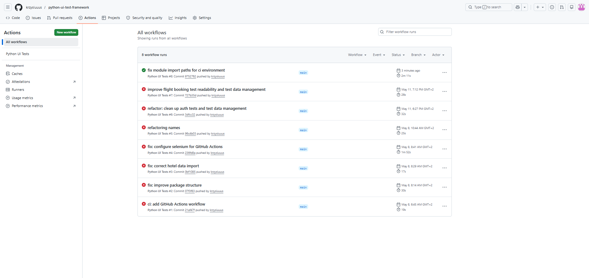
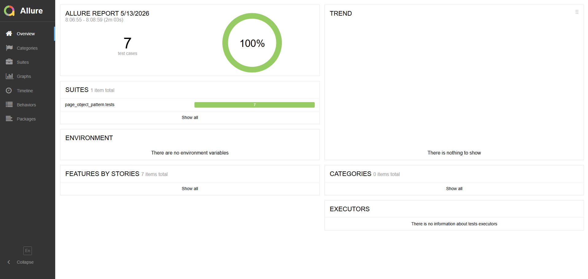

# Python Test Automation Framework


Automated test framework created with Python, Selenium WebDriver, Requests and Pytest.

The project contains both UI and API automated tests designed using scalable test automation architecture patterns such as Page Object Pattern and reusable API client abstraction.

The framework includes end-to-end UI scenarios, API validation, Allure reporting and GitHub Actions CI/CD integration.

## Technologies

- Python
- Selenium WebDriver
- Requests
- Pytest
- Page Object Pattern
- API Client Abstraction
- JSON Schema Validation
- Allure Reports
- GitHub Actions
- Docker
- Jenkins

## Features

- Page Object Pattern architecture
- End-to-end UI and API automation
- GitHub Actions CI pipelines
- Allure reporting
- Headless browser execution
- Test data management
- Screenshot attachment on test failure
- Docker container support
- Jenkins CI pipeline

## Architecture

The framework is based on the Page Object Pattern design approach:

- locators separated from test logic
- reusable page classes
- centralized test configuration
- pytest fixtures for driver management
- Allure integration for reporting
- GitHub Actions CI integration
- Dockerized API test execution

## API Testing

The framework also contains API automated tests built with:

- Requests
- Pytest
- Allure Reports

Implemented API features:

- GET requests
- POST requests
- PUT requests
- DELETE requests
- Positive and negative scenarios
- JSON schema validation
- Response time assertions
- Bearer token authentication
- Reusable API client abstraction
- Parametrized API tests

API tests are separated from UI tests and executed in a dedicated GitHub Actions pipeline job.

## Project Structure

```text
python-test-automation-framework/
├── api_tests/
│   ├── data/
│   ├── schemas/
│   ├── tests/
│   └── utils/
├── page_object_pattern/
│   ├── locators/
│   ├── pages/
│   └── tests/
├── reports/
├── screenshots/
├── requirements.txt
├── pytest.ini
└── README.md
```

## Installation

Clone the repository:

```bash
git clone https://github.com/krzysiuuus/python-test-automation-framework.git
cd python-test-automation-framework
```

Create and activate virtual environment:

```bash
python -m venv venv
venv\Scripts\activate
```

Install dependencies:

```bash
pip install -r requirements.txt
```

## Running Tests

Run all tests:

```bash
pytest
```

Run selected test file:

```bash
pytest page_object_pattern/tests/test_flight_search.py
```

Run API tests:

```bash
pytest api_tests/tests -v
```

## Allure Report

Run tests with Allure results:

```bash
pytest --alluredir=reports
```

Generate and open report:

```bash
allure serve reports
```

## Docker Support

The framework also supports running API automated tests inside Docker containers.

Build Docker image:

```bash
docker build -t python-test-framework .
```

Run API tests inside container:

```bash
docker run python-test-framework
```

Docker container includes:

- Python 3.10 environment
- Installed project dependencies
- Automated API test execution with Pytest
- Reproducible and isolated test environment

## CI/CD

The project uses both GitHub Actions and Jenkins for Continuous Integration.

Implemented CI/CD features:

- automated test execution on every push
- Dockerized test execution
- Jenkins pipeline integration
- GitHub repository checkout
- automated API test execution inside Docker containers
- isolated and reproducible CI environment
- test reporting integration

Jenkins pipeline stages:

- Checkout source code from GitHub
- Build Docker image
- Run automated API tests inside container

## Screenshots

### GitHub Actions Pipeline



### Allure Report



## Future Improvements

- Parallel execution
- Test retries
- Cross-browser testing
- Performance testing

## Author

Created by [krzysiuuus](https://github.com/krzysiuuus)
