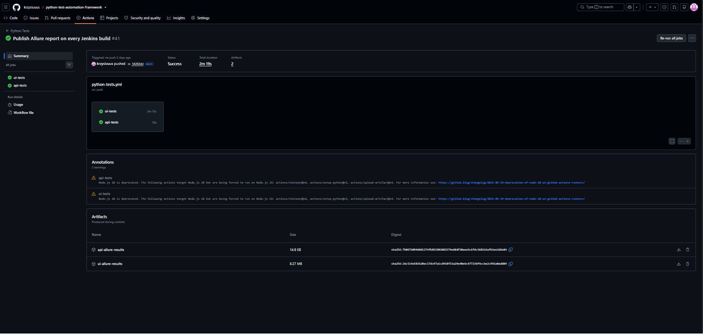
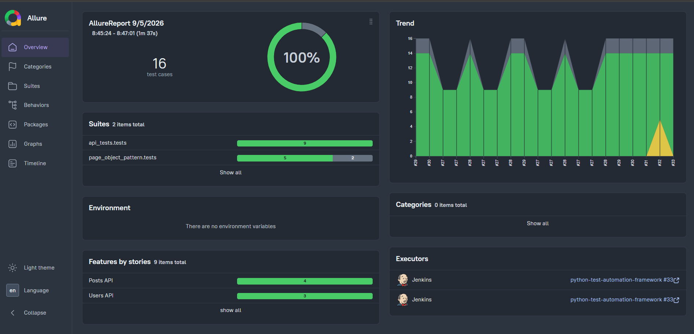

# Python Test Automation Framework


Automated test framework created with Python, Selenium WebDriver, Requests and Pytest.

The project contains both UI and API automated tests designed using scalable test automation architecture patterns such as Page Object Pattern and reusable API client abstraction.

The framework includes end-to-end UI scenarios, API validation, cross-browser execution, Docker, Selenium Grid, Jenkins, GitHub Actions and Allure reporting.

## Technologies

- Python
- Pytest
- Selenium WebDriver
- Requests
- Page Object Pattern
- API Client Abstraction
- JSON Schema Validation
- Faker
- Allure Reports
- Docker
- Docker Compose
- Selenium Grid
- Jenkins
- GitHub Actions
- Pytest Rerun Failures
- WebDriver Manager

## Features

- Page Object Pattern architecture
- Browser Factory
- Centralized configuration
- Centralized logging
- UI and API automated tests
- Positive and negative test scenarios
- Reusable API client
- Test data generation with Faker
- JSON Schema validation
- Response time validation
- Screenshot attachment on UI test failure
- Allure reporting
- Retry mechanism for flaky UI tests
- Local browser execution
- Remote WebDriver execution
- Chrome, Firefox and Edge support
- Selenium Grid
- Dockerized test execution
- Jenkins CI pipeline
- Parameterized Jenkins builds
- Automatic Jenkins builds using SCM polling
- GitHub Actions CI
- Headless execution in CI environments

## Architecture

The framework separates test logic from browser, page and API implementation details.

Main concepts:

- Page Object Pattern for UI automation
- reusable page classes
- centralized locators
- Browser Factory for WebDriver creation
- centralized configuration
- centralized logging
- pytest fixtures for test setup and teardown
- reusable API client
- endpoint-specific API classes
- separate UI and API test suites
- Allure integration
- Docker-based execution
- CI/CD using GitHub Actions and Jenkins

### UI execution flow

```text
Test
  ↓
Page Object
  ↓
Browser Factory
  ↓
WebDriver
  ↓
Local Browser / Selenium Grid
```

### API execution flow

```text
Test
  ↓
Endpoint API class
  ↓
ApiClient
  ↓
HTTP request
  ↓
REST API
```

## Project Structure

```text
python-test-automation-framework/
├── .github/
│ └── workflows/
│ └── python-tests.yml
│
├── api_tests/
│   ├── data/
│   ├── schemas/
│   ├── tests/
│   └── utils/
│
├── core/
│   ├── browser_factory.py
│   ├── config.py
│   └── logger.py
│
├── page_object_pattern/
│   ├── locators/
│   ├── pages/
│   └── tests/
│       ├── conftest.py
│       ├── test_create_account.py
│       ├── test_flight_search.py
│       ├── test_hotel_search.py
│       ├── test_login.py
│       └── test_update_billing_address.py
│
├── reports/
├── screenshots/
│   ├── allure-report.png
│   └── github-actions.png
│
├── pytest.ini
├── requirements.txt
│
├── Dockerfile
├── Dockerfile.jenkins
├── docker-compose.yml
├── docker-compose-grid.yml
├── docker-compose-jenkins.yml
│
├── Jenkinsfile
└── README.md
```

## Installation

Clone the repository:

```bash
git clone https://github.com/krzysiuuus/python-test-automation-framework.git
cd python-test-automation-framework
```
Create virtual environment:

```bash
python -m venv venv
```

Activate it on Windows:

```bash
venv\Scripts\activate
```

Install dependencies:

```bash
pip install -r requirements.txt
```

## Running Tests

### Run API tests

```bash
pytest api_tests/tests -v
```

### Run UI tests locally
Chrome:

```bash
pytest page_object_pattern/tests -v --browser=chrome
```

Firefox:

```bash
pytest page_object_pattern/tests -v --browser=firefox
```

Edge:

```bash
pytest page_object_pattern/tests -v --browser=edge
```

Local UI execution uses a visible browser by default.

### Run selected test
Example:

```bash
pytest page_object_pattern/tests/test_login.py -v
```

### Retry failed UI tests

The framework uses pytest-rerunfailures.

Example:

```bash
pytest page_object_pattern/tests -v --reruns 1 --reruns-delay 2
```

## Selenium Grid

The framework supports remote cross-browser UI execution using Selenium Grid.

The Grid contains:

```text
Selenium Hub
├── Chrome
├── Firefox
└── Edge
```

Start Selenium Grid:

```bash
docker compose -f docker-compose-grid.yml up -d
```
Grid UI: `http://localhost:4444/ui`

Check Grid status: `http://localhost:4444/status`

### Run UI tests through Selenium Grid

Chrome:

```bash
pytest page_object_pattern/tests -v --browser=chrome --remote
```

Firefox:

```bash
pytest page_object_pattern/tests -v --browser=firefox --remote
```

Edge:

```bash
pytest page_object_pattern/tests -v --browser=edge --remote
```

Stop Grid:

```bash
docker compose -f docker-compose-grid.yml down
```

## Browser Factory

Browser creation is centralized in: `core/browser_factory.py`

Supported browsers:

- Chrome
- Firefox
- Edge

Supported execution modes:
```text
LOCAL
REMOTE
```
For remote execution, Selenium Grid URL can be provided through: `REMOTE_URL`

Default value: `http://localhost:4444/wd/hub`

In Docker/Jenkins execution the framework uses: `http://host.docker.internal:4444/wd/hub`

Browser execution details are written to logs, for example:
```text
Starting browser: firefox, remote=True, headless=True
```

## Headless Execution

Headless mode is automatically enabled when: `CI=true`

This allows the same framework to run:

```text
Local execution
→ visible browser

CI execution
→ headless browser
```

## API Testing

API automation is implemented using:

- Requests
- Pytest
- reusable ApiClient
- endpoint-specific API classes
- JSON Schema validation
- Allure

Implemented scenarios include:

- GET requests
- POST requests
- PUT requests
- DELETE requests
- positive scenarios
- negative scenarios
- response status validation
- response time validation
- JSON response validation
- parametrized tests
- reusable API methods

Example endpoints are based on JSONPlaceholder.

## Allure Reports

### Local execution

Generate Allure results:
```bash
pytest api_tests/tests --alluredir=reports/api/allure
```
or:
```bash
pytest page_object_pattern/tests --alluredir=reports/ui/allure
```
Open report:
```bash
allure serve reports/api/allure
```

## Jenkins Allure Report

Jenkins collects results from:
```text
reports/
├── api/
│   └── allure/
└── ui/
    └── allure/
```
Both API and UI results are combined into one Jenkins Allure report.

Allure report publishing is executed in:
```groovy
post {
    always {
        ...
    }
}
```
This means the report is generated even when test execution fails.

Screenshots from failed UI tests are attached to Allure reports.

## Docker

### Test Framework Docker Image

Dockerfile defines the environment used to execute automated tests.

It contains:

- Python
- project dependencies
- Pytest
- Selenium
- Requests
- Allure adapter
- framework source code

Build image:
```bash
docker build -t python-test-framework .
```

### Run API tests with Docker Compose
```bash
docker compose up --build
```
This uses: `docker-compose.yml`

The container provides an isolated and reproducible test execution environment.

## Jenkins

The project supports Jenkins CI running inside Docker.

Start Jenkins:
```bash
docker compose -f docker-compose-jenkins.yml up -d --build
```
Jenkins: `http://localhost:8080`

Stop Jenkins:
```bash
docker compose -f docker-compose-jenkins.yml down
```

### Dockerfile.jenkins

Dockerfile.jenkins defines the Jenkins environment.

It extends the standard Jenkins image with Docker CLI support.

This allows Jenkins pipelines to execute commands such as:
```bash
docker build
docker run
```
The responsibilities are separated as follows:
```text
Dockerfile
→ test execution environment

Dockerfile.jenkins
→ Jenkins CI environment
```

### Jenkins Pipeline

The pipeline is defined as code in: `Jenkinsfile`

Pipeline flow:
```text
GitHub
   ↓
SCM Polling
   ↓
Jenkins
   ↓
Checkout
   ↓
Build Docker Image
   ↓
API Tests
   ↓
UI Tests
   ↓
Selenium Grid
   ↓
Allure Report
```

### Automatic Jenkins Builds

Jenkins checks the Git repository using SCM polling:
```groovy
triggers {
    pollSCM('H/5 * * * *')
}
```
Jenkins checks periodically for repository changes.

A new build is started only when a new commit is detected.

This avoids the need to expose the local Jenkins instance to the Internet through a webhook tunnel.

### Parameterized Jenkins Builds

UI execution can be started for:
```text
chrome
firefox
edge
```
Jenkins provides a BROWSER parameter that is passed to Pytest:
```bash
--browser=${BROWSER}
```
Automatic builds use Chrome as the default browser.

### Jenkins and Selenium Grid

API tests run directly inside the test container and do not require Selenium Grid.

UI tests use remote WebDriver:
```text
Jenkins
   ↓
Python test container
   ↓
Remote WebDriver
   ↓
Selenium Grid
   ↓
Chrome / Firefox / Edge
```
The Grid must be running before Jenkins UI tests are executed.

## GitHub Actions

GitHub Actions provides an additional CI environment independent from Jenkins.

The workflow executes:

- API tests
- UI tests
- dependency installation
- headless browser execution
- Allure result generation
- artifact upload

GitHub Actions runs automatically after repository changes.

Jenkins and GitHub Actions operate independently.
```text
git push
   │
   ├── GitHub Actions
   │
   └── Jenkins SCM polling
```

## Known Demo Application Issues

Some UI tests use public demo applications that are outside the control of this project.

Known issues are marked as expected failures using Pytest xfail.

Examples:

- hotel prices returned as 0
- booking invoice not opened after flight booking

Example:
```python
@pytest.mark.xfail(
    reason="Known issue in demo application: hotel prices returned as 0"
)
```
This prevents external demo application defects from being reported as framework failures.

## Screenshots

### GitHub Actions



### Allure Report



## CI/CD Overview

The project currently supports three execution approaches:
```text
1. LOCAL

pytest
├── API tests
└── UI tests with visible browser


2. LOCAL + SELENIUM GRID

pytest --remote
└── UI tests
    └── Chrome / Firefox / Edge


3. JENKINS

Jenkins
├── API tests in Docker
└── UI tests
    └── Selenium Grid
        ├── Chrome
        ├── Firefox
        └── Edge
```

## Future Improvements

Possible future extensions:

- test analytics and historical trend improvements
- additional API scenarios
- additional UI scenarios
- improved test environment management
- additional reporting metadata

The project intentionally focuses on practical QA Automation concepts without unnecessary infrastructure complexity.

## Author

Created by [krzysiuuus](https://github.com/krzysiuuus)
